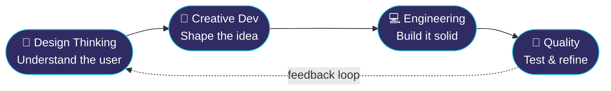

<!-- ═══════════════ HEADER ═══════════════ -->
<div align="center">


<a href="https://git.io/typing-svg">

</a>

<br/>


</div>

<br/>

<!-- ═══════════════ BOOT SCREEN ═══════════════ -->
```console
pranav@portfolio:~$ whoami
> Pranav Karthick S K  ·  ECE undergrad @ Sri Eshwar College of Engineering

pranav@portfolio:~$ cat mission.txt
> "I turn ideas into clean, interactive, and meaningful digital experiences."

pranav@portfolio:~$ ./currently.sh
> 🔍 Breaking & fixing web apps as Software Quality & Accessibility Intern @ Hudsmer
> 🎨 Designing interfaces in Figma before writing a single line of code
> 🧩 Grinding DSA, one LeetCode problem at a time

pranav@portfolio:~$ echo $PHILOSOPHY
> Useful → Intuitive → Accessible → Beautiful → Memorable
```

<br/>

<!-- ═══════════════ ABOUT ═══════════════ -->
## 🧭 &nbsp;The Story So Far

I started in **Electronics & Communication**, fell for the web, and never looked back. Circuits taught me how systems *behave*; design taught me how people *feel*. Now I build where the two meet, shipping products that work reliably **and** feel good to use.

Most developers ask *"does it work?"*
I ask **"does it work for everyone, and would anyone enjoy it?"**

<br/>

<!-- ═══════════════ WORKFLOW DIAGRAM ═══════════════ -->
## 🔁 &nbsp;How I Build



<br/>

<!-- ═══════════════ SKILLS ═══════════════ -->
## ⚔️ &nbsp;Skill Tree

<table>
<tr>
<td width="180"><b>🧠 Languages</b></td>
<td>

</td>
</tr>
<tr>
<td><b>🌐 Web</b></td>
<td>

</td>
</tr>
<tr>
<td><b>🎨 Design</b></td>
<td>
 &nbsp;<sub><code>UI/UX</code> · <code>Prototyping</code> · <code>Responsive Design</code></sub>
</td>
</tr>
<tr>
<td><b>🗄️ Databases</b></td>
<td>

</td>
</tr>
<tr>
<td><b>🧪 Quality & DevOps</b></td>
<td>

</td>
</tr>
<tr>
<td><b>☁️ Cloud & Tools</b></td>
<td>

</td>
</tr>
</table>

<br/>

<!-- ═══════════════ PROJECTS ═══════════════ -->
## 🚀 &nbsp;Quest Log: Featured Projects

<table>
<tr>
<td width="50%" valign="top">

### 🤖 AI-Powered Interview Assistant
*Practice interviews that feel real.*

A structured interview simulator with two worlds: one for the **interviewee**, one for the **interviewer**.

- 📄 Parses your resume to start the session
- ⏱️ Timed rounds that add real pressure
- 📊 Automated scoring, instantly
- 👥 Dual-role dashboards
- ⚛️ Redux Toolkit state architecture


[](INTERVIEW_ASSISTANT_REPO_URL)
[](INTERVIEW_ASSISTANT_LIVE_URL)

</td>
<td width="50%" valign="top">

### 🛡️ PhishSiren
*Your inbox's personal bodyguard.*

Connects to Gmail, scans incoming mail, and **flags phishing in real time** using an ML classifier.

- 📧 Gmail API integration
- 🔐 Secure OAuth 2.0 login
- ⚡ Real-time classification
- 📊 Prediction history tracking
- 🗄️ MongoDB-backed storage


[](PHISHSIREN_REPO_URL)
[](PHISHSIREN_LIVE_URL)

</td>
</tr>
</table>

<br/>

<!-- ═══════════════ EXPERIENCE ═══════════════ -->
## 💼 &nbsp;Career Timeline

```text
 2025 ─────────●───────────────●───────────────●──────────▶ now
               │               │               │
        Spring Boot &      MERN Stack      Software Quality &
        React Intern       Intern          Accessibility Intern
                           Rampex          Hudsmer Business
                           Technologies    Solutions
```

<details open>
<summary><b>🔍 Software Quality & Accessibility Engineer Intern</b> · <i>Hudsmer Business Solutions</i> · <code>Current</code></summary>
<br/>

Making web apps work for **everyone**. Testing, debugging, and documenting defects, with accessibility as a first-class concern.

`Testing` `Debugging` `Troubleshooting` `Accessibility` `Defect Analysis` `Docker` `Claude` `ChatGPT`
</details>

<details>
<summary><b>🌐 MERN Stack Intern</b> · <i>Rampex Technologies</i></summary>
<br/>

Built and deployed MERN web apps with REST APIs and responsive UI components, then debugged and optimized them for production.

`MongoDB` `Express` `React` `Node.js` `REST APIs`
</details>

<details>
<summary><b>⚙️ Spring Boot & React Intern</b></summary>
<br/>

Connected React interfaces to Spring Boot backends: RESTful APIs, business logic, and database operations.

`Spring Boot` `React` `REST APIs` `SQL`
</details>

<br/>

<!-- ═══════════════ PLAYER STATS ═══════════════ -->
## 🧠 &nbsp;Problem-Solving Arena

<div align="center">

| 🟠 LeetCode | 🟤 CodeChef |
|:---:|:---:|
| **250+** solved | **150+** solved |
| Contest rating **1697** | Rating **1081** |

<sub>Focus: <code>DSA</code> · <code>OOP</code> · <code>DBMS</code> · <code>Problem Solving</code></sub>

<br/>


</div>

<br/>

<!-- ═══════════════ ACHIEVEMENTS ═══════════════ -->
## 🏆 &nbsp;Achievements Unlocked

| | Achievement | Rank |
|:-:|---|:-:|
| 🥇 | **Best Speaker Award** · Toastmasters | Gold |
| 🥈 | **Project Expo** · 2nd Place | Silver |
| 🚀 | **GRiD 7.0 by Flipkart** · Semi-Finalist | Elite |
| 🎨 | **VP, Media & Branding** · Student Leadership Council | Leader |
| 💻 | **250+ LeetCode** & **150+ CodeChef** problems | Grinder |

<br/>

<!-- ═══════════════ CERTIFICATIONS ═══════════════ -->
## 📚 &nbsp;Certified Badges

<div align="center">


</div>

<br/>

<!-- ═══════════════ CODE IDENTITY ═══════════════ -->
## 🎯 &nbsp;Currently Exploring

```javascript
const pranav = {
  role: "Creative Developer",
  fuel: ["☕ chai", "🎧 lo-fi", "🐛 a good bug hunt"],
  exploring: ["UI/UX Design", "Creative Development", "Full-Stack", "Accessibility", "Software Quality"],
  mindset: () => "Design → Build → Test → Improve",
  lookingFor: "Teams that care about craft, users, and inclusive design"
};
```

<br/>

<!-- ═══════════════ GITHUB STATS ═══════════════ -->
## 📊 &nbsp;GitHub Activity

<div align="center">


<br/>


<br/><br/>

<!-- OPTIONAL: contribution snake (needs a GitHub Action; setup steps in chat) -->
<!--  -->

</div>

<br/>

<!-- ═══════════════ CONNECT ═══════════════ -->
## 🤝 &nbsp;Let's Build Something

Got a wild idea, a buggy app, or an interface that needs some love? Let's talk.

<div align="center">

<a href="mailto:pranavkarthicksk@gmail.com"></a>
<a href="https://www.linkedin.com/in/pranav-karthick-s-k-516304291"></a>
<a href="https://leetcode.com/u/PrAnaV_120001/"></a>

</div>


